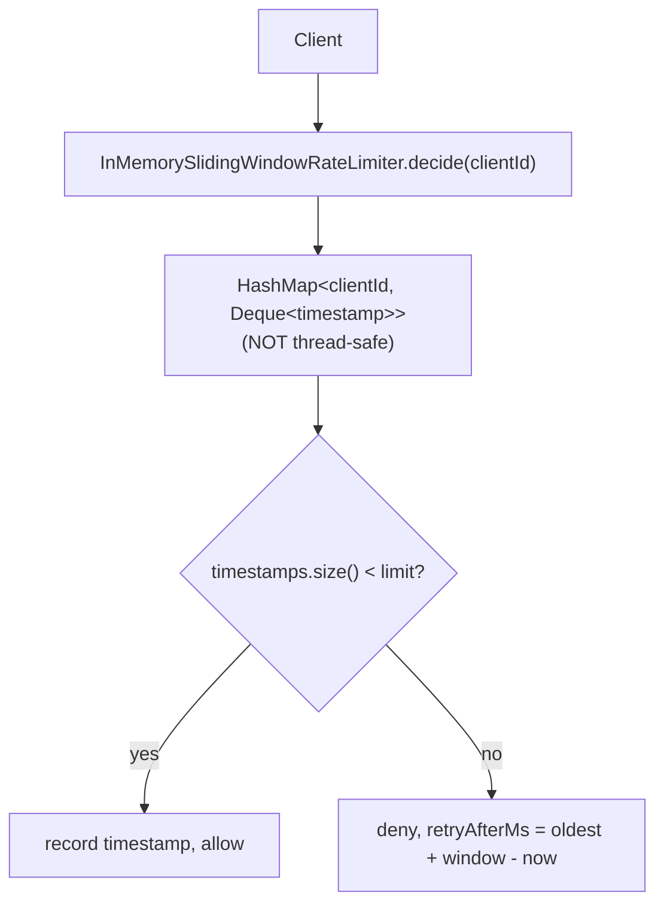
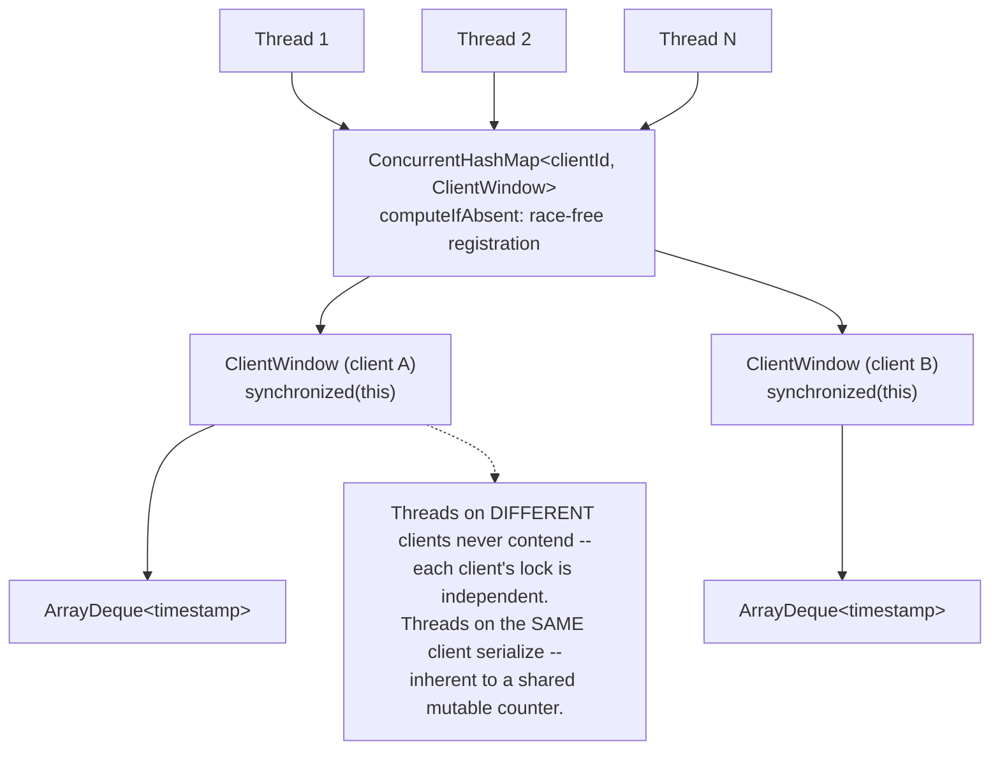
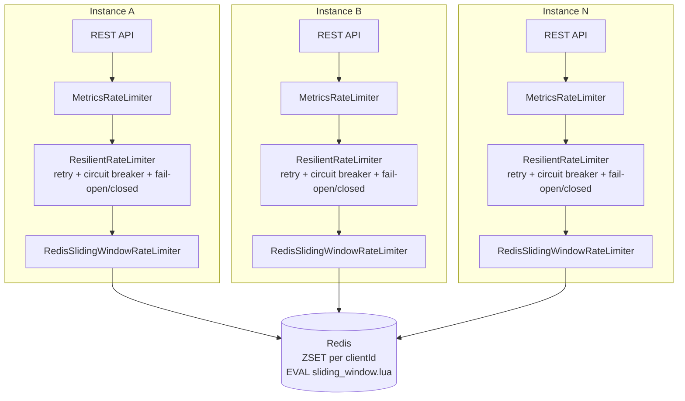
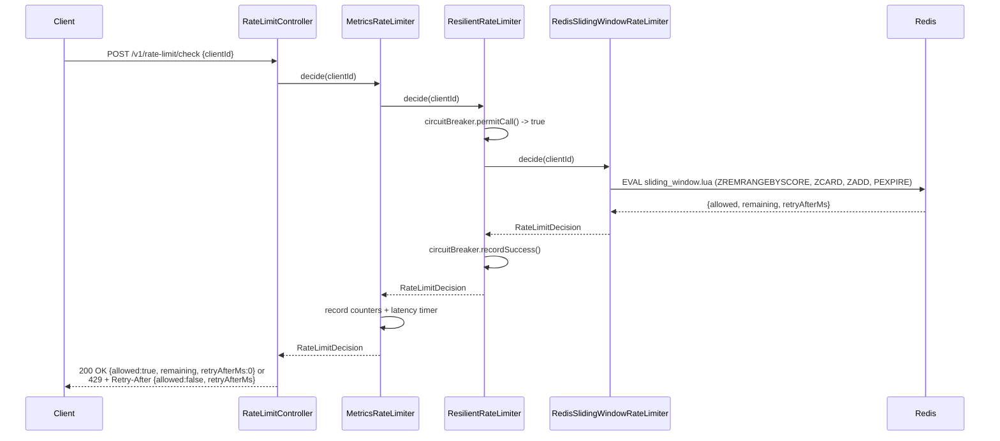
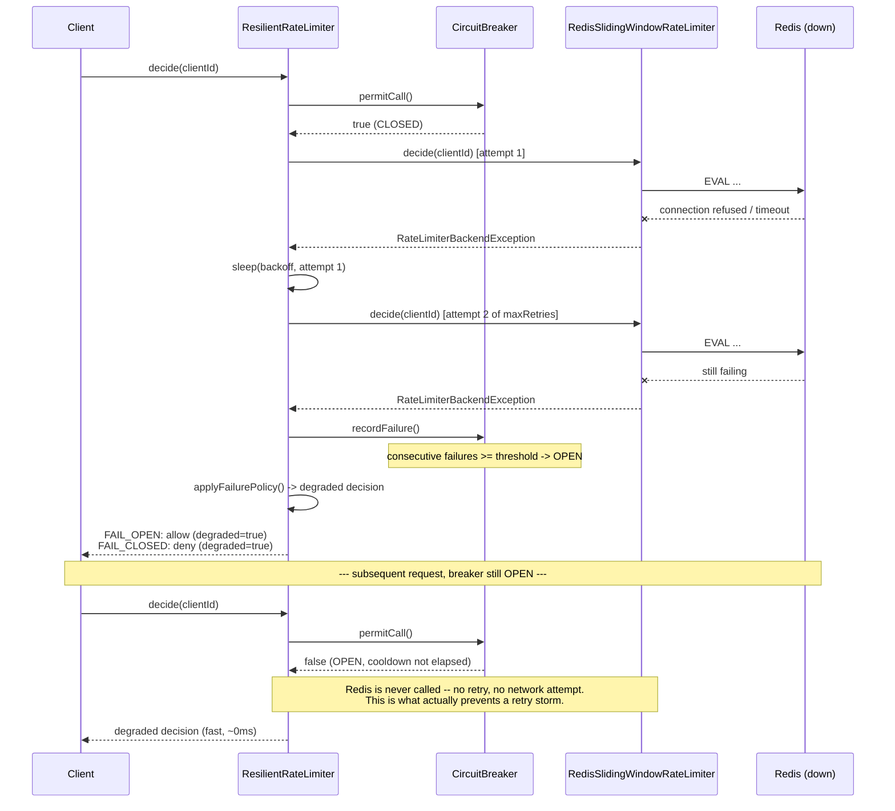

# Architecture

Five diagrams tracing the system from the simplest version (Phase 1) to
the full distributed, failure-aware version (Phase 5+).

## 1. Single-instance in-memory architecture (Phase 1)

The starting point: one JVM, one `HashMap`, correctness proven before
concurrency is even a concern.

## 2. Thread-safe architecture (Phase 2)

Same algorithm, safe under concurrent callers. Two separate hazards,
two separate mechanisms: `ConcurrentHashMap.computeIfAbsent` for
race-free client registration, a per-client lock for the read-check-
write inside one client's window.

## 3. Distributed Redis architecture (Phase 4-6)

Multiple application instances, no shared in-process state -- they
agree only through Redis. Each instance wraps the raw Redis limiter in
the resilience layer before the metrics layer, then exposes it over
HTTP.

## 4. Request sequence (happy path)

## 5. Redis failure path

## Notes on design choices visible in these diagrams

- **The decorator chain (Metrics -> Resilient -> Redis) is the same
  shape in every environment.** In `IN_MEMORY` mode, `Resilient`/`Redis`
  are simply absent -- `Metrics` wraps `InMemorySlidingWindowRateLimiter`
  directly. One `RateLimiter` interface, composed differently per mode,
  wired in one place (`RateLimiterConfig`).
- **The circuit breaker is what makes diagram 5 different from "just
  retries."** Retries alone still touch Redis (and pay backoff) on every
  request during an outage. The breaker remembers the outage across
  requests and skips Redis entirely once it's open.
- **Readiness/liveness deliberately don't appear as failing in diagram
  5.** The whole point of fail-open/fail-closed is that the service
  keeps answering `/v1/rate-limit/check` through a Redis outage --
  `RateLimiterHealthIndicator` always reports UP and surfaces
  `redisCircuitOpen` as a detail instead, so a Kubernetes readiness
  probe doesn't pull a perfectly-functional pod out of rotation over a
  dependency the app is explicitly designed to tolerate losing.
