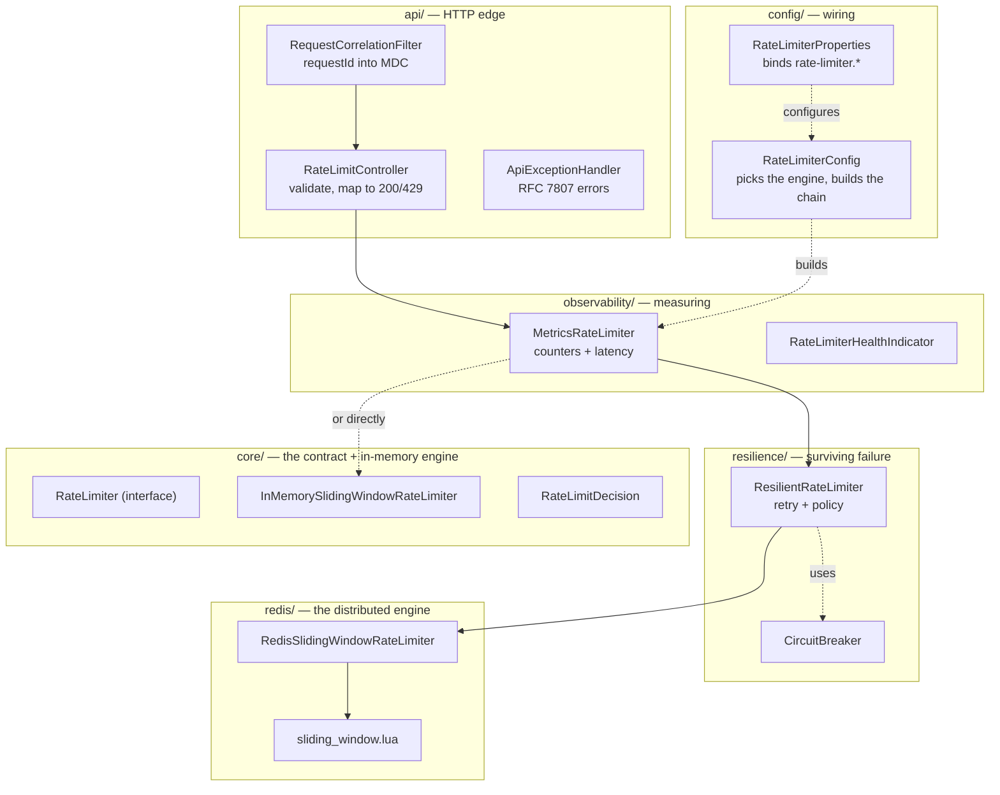

# Beginner's Guide: understanding this project end to end

## Who this is for

You can read Java and you know what an HTTP API is. You have not spent much
time on concurrency (threads, locks, race conditions) or on distributed systems
(many servers sharing state). This guide starts there and builds up until the
whole project makes sense.

It teaches the system. Three other docs use it:

| Doc | What it's for | Read it |
|---|---|---|
| **This guide** | Learn the system from zero | First |
| [`TOOLS_AND_SCALING.md`](TOOLS_AND_SCALING.md) | What each tool in the stack does, and what happens as load grows | Second |
| [`ARCHITECTURE.md`](ARCHITECTURE.md) | Five diagrams of the same system | Alongside §5 below |
| [`INTERVIEW_GUIDE.md`](INTERVIEW_GUIDE.md) | Defending the design decisions out loud | Last, once the rest clicks |

A note on numbers: every performance figure in this guide comes from a
benchmark that was actually run on this code, recorded in
[`benchmark/RESULTS.md`](../benchmark/RESULTS.md). Nothing is estimated or
rounded off from memory. Where there's no measurement, this guide describes the
mechanism instead of inventing a number — including in the scaling doc.

---

## 1. The problem, in plain terms

A **rate limiter** answers one question, very fast, over and over:

> This client has made a request. Should I allow it, or reject it?

The rule is usually "no more than N requests per T seconds, per client." That's
it. The interface in this project is exactly that small:

```java
// src/main/java/com/ratelimiter/core/RateLimiter.java
boolean tryAcquire(String clientId);
```

### Why anyone needs this

**1. Abuse and scraping.** Someone points a script at your public API and pulls
a million records. Without a limit, your database absorbs it.

**2. Cost control.** Your endpoint calls something expensive per request — an
LLM, a payments provider, an SMS gateway. One buggy client in a retry loop can
generate a real bill overnight.

**3. Fairness between tenants.** You have 500 customers on shared
infrastructure. One of them writes an accidental infinite loop. Without
per-client limits, the other 499 get a slow API because of one neighbor. This is
the "noisy neighbor" problem, and a per-client rate limiter is the standard
answer.

Notice all three are *per client*. A global "10,000 requests/sec total" limit
wouldn't fix any of them — the abusive client would just consume the shared
budget. That's why the key of everything in this project is `clientId`.

### What "allow" really means here

This service doesn't proxy your traffic. It answers a question. Your real API
calls it and acts on the answer:

```
Your API receives a request
  → asks this service: "is client-123 allowed?"
  → allowed:  do the real work
  → denied:   return 429 Too Many Requests to the caller
```

Keeping the limiter as a decision service (rather than a proxy) keeps it small
and testable. It also means its own latency is directly in your request path —
which is why so much of this project cares about tail latency.

---

## 2. The concepts you need first

Six ideas. Each ends with where it shows up in this repo, so nothing stays
abstract.

### 2.1 One server, many requests at once

When your Spring Boot app receives 100 HTTP requests simultaneously, it does
**not** handle them one after another. Tomcat (the web server embedded in Spring
Boot) keeps a pool of worker threads and hands each incoming request to a free
thread. 100 requests can be inside your code at the same moment, on 100
different threads.

That's great for throughput and it's the source of every hard bug in this
project. The moment two threads touch the same data, you need to think about
what happens if they interleave.

> **In this repo:** you can see it in the logs. Every log line carries a
> `thread` field like `http-nio-8080-exec-10` — that's Tomcat worker thread #10.

### 2.2 Shared mutable state and the check-then-act race

Say we track a client's requests in a list, and the limit is 3. The naive code:

```java
if (timestamps.size() < limit) {   // (1) CHECK
    timestamps.add(now);           // (2) ACT
    return true;
}
return false;
```

Read it as a single thread and it's obviously correct. Now put two threads on it
with the list already holding 2 entries:

| Time | Thread A | Thread B | List size |
|---|---|---|---|
| t1 | reads size = 2, `2 < 3` ✓ | | 2 |
| t2 | | reads size = 2, `2 < 3` ✓ | 2 |
| t3 | adds → allowed | | 3 |
| t4 | | adds → allowed | **4** |

Both threads checked *before* either acted. Both saw room. Both were allowed.
The client is now at 4 requests against a limit of 3.

This is a **race condition** — specifically a *check-then-act* race. The gap
between reading state and writing it is where the bug lives.

> **In this repo — and this was actually measured, not assumed:** running a bare
> unsynchronized `ArrayDeque` under 64 threads × 50 attempts against a limit of
> 100 admitted **181, 117, and 161** requests across three runs. Same code shape
> as `src/test/java/com/ratelimiter/concurrency/InMemoryRateLimiterConcurrencyTest.java`.
> The overshoot isn't theoretical and it isn't consistent — which is exactly what
> makes these bugs miserable to find in production.

### 2.3 Locks, and how coarse to make them

A **lock** fixes this. One thread holds it at a time; everyone else waits. Wrap
check-and-act in a lock and they become one indivisible step — nobody can
observe the middle.

The real question isn't *whether* to lock, it's **how much to lock**.

**Option A — one global lock.** Correct, and simple. But every client's request
now queues behind every other client's request, even though client A and client
B share no data at all. You've serialized your entire service.

**Option B — one lock per client.** Also correct. Client A and client B never
wait for each other; only requests *for the same client* serialize — which they
must, because they genuinely share state.

This project uses Option B, and the benchmark shows the difference concretely.
On a 4-core machine, at 50 threads: every thread hammering one shared client
reached ~3.7M ops/sec; every thread on its own client reached ~21.9M ops/sec.
Option A would impose that first number on everybody.

> **In this repo:** `src/main/java/com/ratelimiter/core/InMemorySlidingWindowRateLimiter.java`.
> Each client gets a `ClientWindow` object, and `recordAttempt()` is
> `synchronized` on that object — so the lock is per client, not global.

There's a second, subtler race hiding here: what if two threads discover a
brand-new client at the same instant and both create a `ClientWindow`? One would
overwrite the other, silently resetting that client's quota. `ConcurrentHashMap.computeIfAbsent`
solves it — it guarantees the creation function runs at most once per key, even
under concurrent callers.

Two hazards, two mechanisms. Worth being able to name both separately.

### 2.4 Why in-memory breaks the moment you run two servers

Everything above lives inside **one JVM's memory**. Now deploy two instances
behind a load balancer:

```
                    ┌─► Instance A   (its own HashMap, its own counts)
Load balancer ──────┤
                    └─► Instance B   (its own HashMap, its own counts)
```

A client with a limit of 10 sends 20 requests. The load balancer spreads them —
10 to A, 10 to B. Each instance sees 10, each says "that's exactly at the
limit," and the client gets **20 requests through a limit of 10**.

Nothing is broken in either instance. Each is perfectly correct about the traffic
*it* saw. The problem is that "the limit" is a property of the whole system, and
no single instance can see the whole system.

The fix: move the state somewhere both instances share. That's what Redis is for
here — not as a cache, but as the **single source of truth** that instances
agree on.

> **In this repo:** switching from `rate-limiter.mode=IN_MEMORY` to `REDIS` is
> exactly this change, and
> `src/test/java/com/ratelimiter/integration/RedisSlidingWindowRateLimiterIT.java`
> proves it by running two independent limiter instances against one Redis and
> asserting they *together* honor one limit.

### 2.5 Atomicity over a network

So we put the counter in Redis. Naive approach:

```java
int count = redis.get(key);        // 1. read over the network
if (count < limit) {               // 2. decide, in your app's memory
    redis.set(key, count + 1);     // 3. write over the network
}
```

This is the **exact same check-then-act race as §2.2** — just stretched across a
network and now between *machines* rather than threads. Instance A reads 9,
Instance B reads 9 before A writes, both decide there's room, both write 10.

Locks in your JVM can't help. Instance A's lock means nothing to Instance B —
they're separate processes on separate machines.

**The fix is to stop splitting the operation.** Redis can run a Lua script with
`EVAL`, and Redis executes that script as one indivisible unit: Redis processes
commands on a single thread, and no other client's commands interleave inside a
running script. So if the read, the decision, *and* the write all happen inside
the script, there is no gap for anyone to race into — because there are no
separate round trips anymore.

> **In this repo:** `src/main/resources/scripts/sliding_window.lua`. Walked line
> by line in §5.

This was verified rather than assumed: 200 concurrent `redis-cli` script
invocations against a single key with a limit of 50 left **exactly 50** entries
in Redis.

### 2.6 Fixed window vs sliding window

Now the algorithm itself. "10 requests per minute" — how do you count?

**Fixed window.** Keep a counter, reset it at the top of each minute. One integer
per client, very cheap. But look at the boundary:

```
     12:00:59.9 ──┐  ┌── 12:01:00.1
                  │  │
   window 12:00 ──┴──┴── window 12:01
        10 requests    10 requests
        └──────────────────────┘
          20 requests in 0.2 seconds
```

The client sent 10 at the very end of one window and 10 at the very start of the
next. Both windows are individually within limit. The client got **double the
limit** in a fraction of a second. If your limit exists to protect a fragile
downstream, that burst is precisely what you were trying to prevent.

**Sliding window (used here).** No reset points. Store the actual timestamps and
ask "how many happened in the last 60 seconds, counting backwards from *now*?"
The window moves continuously with the clock, so there's no boundary to exploit.

The cost: you store up to `limit` timestamps per client instead of one integer.
That's the deliberate trade — memory for precision.

**One precise detail** that both implementations share: a timestamp *exactly*
`window` milliseconds old counts as expired. So with a 1000ms window, a request
at t=0 blocks a retry at t=999 but not at t=1000. It's an arbitrary choice —
what matters is that it's consistent, documented, and tested identically in both
engines, so behavior never changes based on which backend is running.

> **In this repo:** `boundaryTimestampExactlyAtWindowEdgeIsTreatedAsExpired` in
> `src/test/java/com/ratelimiter/core/InMemorySlidingWindowRateLimiterTest.java`
> pins exactly this.

---

## 3. Five-minute hands-on tour

Nothing below needs Redis or Docker.

### Start it

```bash
mvn spring-boot:run
```

Default config (`src/main/resources/application.yml`): in-memory mode, **10
requests per 1000ms**.

### Use up the quota

```bash
for i in $(seq 1 11); do
  curl -s -w " [%{http_code}]\n" -X POST http://localhost:8080/v1/rate-limit/check \
    -H "Content-Type: application/json" -d '{"clientId":"alice"}'
done
```

Requests 1–10 are allowed, `remaining` counting down; request 11 is rejected:

```
{"allowed":true,"remaining":9,"retryAfterMs":0,"degraded":false} [200]
{"allowed":true,"remaining":8,"retryAfterMs":0,"degraded":false} [200]
...
{"allowed":true,"remaining":0,"retryAfterMs":0,"degraded":false} [200]
{"allowed":false,"remaining":0,"retryAfterMs":838,"degraded":false} [429]
```

Three things to notice:

- **429**, not 200 — the HTTP status carries the decision too, so a caller can
  act on it without parsing the body.
- **`retryAfterMs`** — not a guess. The oldest request in the window is the next
  one to expire, so that value is when a slot actually frees up. Your exact
  number will differ (it depends how fast your loop ran); the point is that it's
  computed from real state, not a fixed guess. The response also carries a
  standard `Retry-After` header, in seconds rounded up.
- **`degraded: false`** — this was a real quota decision. §7 explains when it
  isn't.

### Prove clients are isolated

```bash
curl -s -X POST http://localhost:8080/v1/rate-limit/check \
  -H "Content-Type: application/json" -d '{"clientId":"bob"}'
```

`bob` gets `remaining: 9` — a full fresh quota, untouched by `alice` being
locked out.

### Watch the window slide

Wait a second and retry `alice`. She's allowed again: her oldest timestamps have
aged out of the window. Nothing was reset — the window moved.

### Look at the operational surface

```bash
curl -s http://localhost:8080/actuator/health | python3 -m json.tool
curl -s http://localhost:8080/actuator/prometheus | grep "^rate_limiter"
```

You'll see counters for allowed/denied decisions and a latency histogram. §9 of
[`TOOLS_AND_SCALING.md`](TOOLS_AND_SCALING.md) covers what an operator does with
these.

---

## 4. Following one request end to end

This is the core of the guide. One `POST /v1/rate-limit/check` in Redis mode,
all the way down and back. ([`ARCHITECTURE.md`](ARCHITECTURE.md) §4 draws the
same trip as a sequence diagram.)

### Step 1 — Tomcat picks a thread

The embedded server accepts the connection and assigns a worker thread from its
pool (`http-nio-8080-exec-N`). Everything from here runs on that one thread,
and that thread is **blocked** until the response is written. Remember this — it
matters in §7 and drives a real limitation discussed in the scaling doc.

### Step 2 — `RequestCorrelationFilter` tags the request

`src/main/java/com/ratelimiter/api/RequestCorrelationFilter.java`

Generates a UUID (or reuses an inbound `X-Request-Id`) and puts it in **MDC** —
a per-thread map that the logging framework automatically attaches to every log
line written by this thread. So every log statement produced anywhere below,
including deep inside the retry logic, carries the same `requestId`.

Why it earns its place: in a multi-threaded server, log lines from concurrent
requests interleave. Without a correlation ID you cannot reconstruct one
request's story. It also echoes the ID back as a response header, so a caller
reporting a problem can hand you the exact ID to grep for.

It clears MDC in a `finally` block — thread pools *reuse* threads, so a value
left behind would leak into an unrelated later request.

### Step 3 — `RateLimitController` validates the input

`src/main/java/com/ratelimiter/api/RateLimitController.java`

Jackson deserializes the JSON into `RateLimitCheckRequest`, and `@Valid`
triggers Bean Validation *before* the controller body runs:

```java
@NotBlank  @Size(max = 256)  String clientId
```

Blank, missing, or oversized `clientId` never reaches the limiter — it's
rejected as `400 Bad Request` in RFC 7807 problem-detail JSON. The `@Size` cap
matters more than it looks: `clientId` becomes part of a Redis key, so an
unbounded one is an unbounded key.

### Step 4 — `MetricsRateLimiter` starts the clock

`src/main/java/com/ratelimiter/observability/MetricsRateLimiter.java`

The outermost of three layers wrapping the actual limiter. It records
`System.nanoTime()`, calls the next layer, and in a `finally` block records the
elapsed time into a Micrometer timer plus an allowed/denied counter.

Being outermost is deliberate: it measures what the *caller* experiences —
including any Redis round trip, retries and backoff underneath.

### Step 5 — `ResilientRateLimiter` decides whether to even try

`src/main/java/com/ratelimiter/resilience/ResilientRateLimiter.java`

First it asks the circuit breaker for permission:

```java
if (!circuitBreaker.permitCall()) {
    // Redis is known-bad. Don't call it. Apply the failure policy now.
}
```

On the happy path the breaker is closed, so the call proceeds into a retry loop
(details in §7, which is where this layer gets interesting).

### Step 6 — `RedisSlidingWindowRateLimiter` builds keys and calls Redis

`src/main/java/com/ratelimiter/redis/RedisSlidingWindowRateLimiter.java`

```java
String zsetKey = keyPrefix + clientId;      // "rl:client-123"
String seqKey  = zsetKey + ":seq";          // "rl:client-123:seq"
```

Every client gets its own keys — that's what client isolation *is* at the
storage layer. Then it executes the Lua script with those keys and
`(limit, windowMillis)` as arguments.

Two details worth knowing:

- Spring Data Redis sends **`EVALSHA`** — the SHA-1 hash of the script rather
  than its full text — falling back to `EVAL` if Redis doesn't have it cached
  yet. The script body crosses the network once, not once per request.
- Everything is sent as **plain strings** (`StringRedisTemplate`), never Java
  object serialization. The data stays readable with `redis-cli`, and you avoid
  the versioning and security problems of JDK serialization.

Any failure here is wrapped in `RateLimiterBackendException` and thrown. This
class deliberately does **not** decide what to do about failure — that's §5's
job. One class, one concern.

### Step 7 — The Lua script runs, atomically

`src/main/resources/scripts/sliding_window.lua`. This is where the actual
algorithm lives. Everything below happens as one indivisible unit.

**Get the time — from Redis, not the caller:**
```lua
local time_parts = redis.call('TIME')
local now_ms = (tonumber(time_parts[1]) * 1000) + math.floor(tonumber(time_parts[2]) / 1000)
local window_start = now_ms - window_ms
```
Every app instance now agrees on one clock. If each instance used its own
`System.currentTimeMillis()`, ordinary clock drift between servers would mean
they disagree about when a window started — and a client on a "slow" machine
would get extra requests. One shared clock removes that whole class of bug.

**Drop everything outside the window:**
```lua
redis.call('ZREMRANGEBYSCORE', zset_key, '-inf', window_start)
```
The data structure is a **sorted set** (ZSET): members with a numeric score,
kept in score order. Score = timestamp. So "remove everything from `-inf` up to
`window_start`" is exactly "forget requests older than the window," and Redis
does it efficiently because the set is already sorted by score.

This is also the **sliding** part — the window moves because `window_start` is
recomputed from *now* on every single call.

**Count what's left and decide:**
```lua
local count = redis.call('ZCARD', zset_key)
if count < limit then
```

**If allowed, record it:**
```lua
local seq = redis.call('INCR', seq_key)
local member = now_ms .. '-' .. seq
redis.call('ZADD', zset_key, now_ms, member)
redis.call('PEXPIRE', zset_key, ttl_ms)
redis.call('PEXPIRE', seq_key, ttl_ms)
return {1, limit - count - 1, 0}
```

Why the `seq` counter? ZSET *members* must be unique. Two requests in the same
millisecond would produce the same member string, and the second `ZADD` would
silently overwrite the first instead of adding — undercounting the client. The
incrementing sequence guarantees uniqueness. It's a small detail with a real
correctness consequence.

`PEXPIRE` sets a TTL of `window + 1s`, refreshed on every call. Without it, every
client ever seen would leave keys in Redis forever. With it, a client that stops
sending traffic has its keys reclaimed automatically. **The TTL is a memory-leak
guard, not part of the algorithm** — the algorithm's correctness comes from
`ZREMRANGEBYSCORE`.

**If denied, compute an honest retry hint:**
```lua
local oldest = redis.call('ZRANGE', zset_key, 0, 0, 'WITHSCORES')
retry_after_ms = (tonumber(oldest[2]) + window_ms) - now_ms
```
The oldest timestamp in the window is the next one to expire, so it's exactly
when a slot frees up. That's where the `891` in §3 came from.

Note the TTL is refreshed on the denied path too. A client being hammered past
its limit must not have its history quietly expire mid-burst — that would reset
its quota and let the burst through.

### Step 8 — Back up the stack

The script returns `{allowed, remaining, retryAfterMs}`, which becomes a
`RateLimitDecision` record. On the way back up:

- `ResilientRateLimiter` calls `circuitBreaker.recordSuccess()` — Redis is
  healthy, so any accumulated failure count resets.
- `MetricsRateLimiter` records the timing and increments the allowed or denied
  counter.
- `RateLimitController` maps the decision to HTTP: `200 OK`, or `429 Too Many
  Requests` plus a `Retry-After` header when denied.
- `RequestCorrelationFilter` clears MDC in its `finally`, and the thread returns
  to the pool.

---

## 5. The two engines, side by side

Both implement the same `RateLimiter` interface, and `RateLimiterConfig` picks
one at startup from `rate-limiter.mode`. Nothing else in the codebase knows
which is running.

| | **In-memory** | **Redis-backed** |
|---|---|---|
| State lives in | JVM heap (`ConcurrentHashMap`) | Redis (`ZSET` per client) |
| Atomicity from | per-client `synchronized` lock | Lua script (`EVAL`) |
| Clock | local `System.currentTimeMillis()` | Redis `TIME` (shared) |
| Scope of the limit | **per instance** | **whole fleet** |
| Cost per decision | in-process memory access | one network round trip |
| Survives restart? | No — state is lost | Yes |
| Fails when… | never (no dependency) | Redis unreachable → §7 |
| Good for | single instance; per-instance quotas | multiple instances sharing one limit |

The key insight: **they are not "dev vs prod" versions of each other.** They
answer different questions. In-memory enforces "10 per second *on this box*";
Redis enforces "10 per second *across the fleet*." Choose by which guarantee you
need — and the price of the stronger guarantee is a network dependency you now
have to handle failing.

Both deliberately implement the *identical* windowing rule (including the
exactly-at-the-boundary case from §2.6), so a client can't detect which one is
behind the API.

---

## 6. When Redis dies

This is where a rate limiter earns its keep, because the answer isn't obvious.

Your limiter's backing store is down. **Do you allow traffic or reject it?**

Both answers are defensible, and both are wrong for somebody:

- **Fail open** — allow. Your service stays up; the limit isn't enforced while
  Redis is down. A client could burst freely. Right when the limiter guards
  against *abuse*, and an outage of the limiter shouldn't become an outage of
  the product.
- **Fail closed** — reject. The limit is never silently bypassed; but a Redis
  outage becomes a total outage of everything behind the limiter. Right when the
  limiter is the only thing protecting something fragile or expensive, and
  overwhelming it would be worse than rejecting traffic.

Because there's no universal answer, it's **configuration**, not a hardcoded
decision: `rate-limiter.redis.failure-policy` = `FAIL_OPEN` | `FAIL_CLOSED`.
(`terraform/environments/` ships dev as fail-open and prod as fail-closed, on
purpose.)

### What actually happens, in order

**1. Retry — briefly.** Not every blip is an outage. `ResilientRateLimiter`
retries up to `max-retries` (default 2) with **exponential backoff and jitter**:
each wait is longer than the last, plus randomness. The jitter matters — if
every instance retried on the same fixed schedule, they'd all hit the recovering
Redis simultaneously, in waves. Randomizing spreads them out.

**2. Give up and classify.** Retries exhausted. The failure is classified as
`TIMEOUT`, `CONNECTION`, or `UNKNOWN` — not to change the retry behavior, but
because an operator needs to know *which*: connection refused means Redis is
down, timeouts mean it's overloaded or the network is degraded. Different
problems, different fixes.

**3. Open the circuit.** After `circuit-breaker-failure-threshold` (default 5)
consecutive failures, the `CircuitBreaker` flips to OPEN — and **subsequent
requests stop calling Redis entirely.**

This step is the one people miss. Bounded retries cap the cost of *one* request.
But with a fleet of servers at high traffic, if every request still makes 3
doomed attempts with backoff, you've built a **retry storm**: thousands of
pointless connections per second aimed at a service that's already down, often
preventing it from recovering. The breaker remembers "Redis is bad" *across*
requests, so the fleet stops hammering it.

Measured: once the breaker was open, a request completed in **0.010s wall
clock** (`time curl`) — versus a path configured to spend up to 200ms per
attempt across up to 3 attempts plus backoff. The short-circuit is doing real
work.

**4. Probe for recovery.** After `circuit-breaker-open-duration-millis`, the
breaker goes HALF_OPEN and lets traffic through as a trial. One success closes
it; one failure reopens it immediately. This is how it recovers on its own
without anyone paging a human.

**5. Apply the policy and be honest about it.** The configured policy decides,
and the response says so:

```json
{"allowed": true, "remaining": -1, "retryAfterMs": 0, "degraded": true}
```

`degraded: true` means *this was not a real quota decision*. `remaining: -1`
means unknown — because it genuinely is. A fallback that looked identical to a
real decision would be actively dangerous: dashboards would look healthy while
the limiter silently wasn't limiting. The flag is also a metric
(`rate_limiter.decisions.degraded`), so it's alertable.

### A deliberate health-check choice

`RateLimiterHealthIndicator` always reports **UP**, even with Redis down. That
looks wrong until you think it through: this service is *still answering
requests correctly per its configured policy*. If it reported DOWN, Kubernetes
would kill or de-register a pod that is working exactly as designed — turning a
dependency failure into a self-inflicted outage.

Instead it reports UP and exposes `redisCircuitOpen: true` as a *detail*.
Operators see the degradation; the orchestrator doesn't overreact. Signal
visibility and failure response are separate concerns.

---

## 7. How the code is organized



### Why the layering is decorators

`MetricsRateLimiter` → `ResilientRateLimiter` → `RedisSlidingWindowRateLimiter`
are three classes that all implement `RateLimiter` and each wrap the next. That's
the **decorator pattern**, and it's the central structural decision:

| Layer | Its one job | What it deliberately doesn't know |
|---|---|---|
| `MetricsRateLimiter` | Measure what happened | How limiting works, or how failure is handled |
| `ResilientRateLimiter` | Decide what to do when the backend fails | How the algorithm works |
| `RedisSlidingWindowRateLimiter` | Be correct when Redis is reachable | What to do when it isn't |
| `InMemorySlidingWindowRateLimiter` | Be correct in one JVM | Anything about networks |

The payoff is testability. You can test retry-and-circuit-breaker logic with a
fake backend that fails on command — no Redis needed, no timing flakiness. And
you can test algorithm correctness without simulating failures. If these were
one class, every test would need the whole world present.

In `IN_MEMORY` mode the chain is just `MetricsRateLimiter → InMemorySlidingWindowRateLimiter`;
the resilience layer isn't there because there's no network to fail. Same
interface, different composition — assembled in one place,
`RateLimiterConfig`.

---

## 8. How the tests prove it

Coverage percentage is not the goal; each test pins down a specific claim.

| Test | What it *proves* |
|---|---|
| `InMemorySlidingWindowRateLimiterTest` | The algorithm: limit enforcement, window expiry, client isolation, unknown clients, and the exact boundary case. Uses `ManualClock`, so no `Thread.sleep` and no flakiness |
| `InMemoryRateLimiterConcurrencyTest` | 64 threads on one client are admitted *exactly* to the limit; 200 threads across 20 clients stay isolated. This is the test that fails on unsynchronized code |
| `CircuitBreakerTest` | The state machine: trips at threshold, stays open through cooldown, half-opens, one failure reopens it |
| `ResilientRateLimiterTest` | Retry budget respected; fail-open allows; fail-closed denies; both marked degraded; an open circuit never touches the delegate |
| `MetricsRateLimiterTest` | Allowed/denied/degraded counted separately; the decision passes through unmodified |
| `RateLimitControllerTest` | HTTP contract: 200 vs 429, `Retry-After` value, and that bad input is rejected before reaching the limiter |
| `RateLimitApiTest` | Full Spring context, real server, real HTTP — proves the wiring, not just the pieces |
| `RedisSlidingWindowRateLimiterIT` | Against real Redis: **two separate instances sharing one limit** — the distributed claim itself |
| `RateLimitApiRedisIT` | The whole stack together in Redis mode |

### `*Test` vs `*IT` — why two suffixes

Maven runs them with different plugins at different times:

- **`*Test`** → Surefire, during `mvn test`. Fast, no external dependencies.
- **`*IT`** → Failsafe, during `mvn verify`. Needs Docker (Testcontainers starts
  a real Redis).

The split means every developer and every CI push gets fast feedback without
Docker, while the tests that need real infrastructure run as an explicit,
separate step. `mvn test` currently runs **49 tests**, all passing.

---

## 9. Glossary

| Term | Meaning |
|---|---|
| **Atomic** | Happens completely or not at all, with no observable middle state |
| **Race condition** | A bug where the outcome depends on the timing of concurrent operations |
| **Check-then-act** | The specific race in §2.2: reading state, then acting on a value that may already be stale |
| **Lock / mutex** | A gate ensuring one thread at a time in a section of code |
| **Contention** | Threads waiting on the same lock; the cost of sharing |
| **Fine-grained locking** | Many small locks (here: per client) instead of one big one |
| **Thread pool** | A reused set of worker threads; Tomcat hands each request to one |
| **Tail latency** | The slow end of the distribution (p99, max) — where contention shows up first |
| **p50 / p99** | The value 50% / 99% of requests are faster than |
| **Throughput** | Operations completed per unit time |
| **Hot key** | One key receiving a disproportionate share of traffic |
| **Sliding window** | Counting over a continuously moving time range |
| **Fixed window** | Counting in discrete buckets that reset — vulnerable to boundary bursts |
| **ZSET** | Redis sorted set: members with numeric scores, kept ordered |
| **TTL** | Time to live; automatic expiry of a key |
| **`EVAL` / `EVALSHA`** | Run a Lua script on Redis; `EVALSHA` sends its hash instead of its text |
| **Circuit breaker** | A gate that stops calling a known-failing dependency, then probes for recovery |
| **Fail open / fail closed** | Allow / reject when the backing store is unavailable |
| **Degraded** | A decision made by fallback policy, not from real state |
| **Retry storm** | A fleet's retries overwhelming an already-struggling service |
| **Jitter** | Randomness added to backoff so clients don't retry in sync |
| **Thundering herd** | Everyone hitting a recovering service at once |
| **Idempotent** | Doing it twice has the same effect as once |
| **Linearizable** | Operations appear to happen in one global order, instantly |
| **MDC** | Mapped Diagnostic Context — per-thread values auto-attached to log lines |
| **Decorator** | An object wrapping another with the same interface, adding one behavior |
| **Backpressure** | Signalling a caller to slow down — a 429 is backpressure |

---

## 10. Where to go next

1. **[`TOOLS_AND_SCALING.md`](TOOLS_AND_SCALING.md)** — every tool in the stack
   and what happens to it as load grows. The natural sequel.
2. **[`ARCHITECTURE.md`](ARCHITECTURE.md)** — the same system as five diagrams.
3. **[`benchmark/RESULTS.md`](../benchmark/RESULTS.md)** — the real numbers, the
   methodology, and what they do and don't prove. Run `./benchmark/run.sh`
   yourself; your machine will give different numbers, and understanding *why*
   is the point.
4. **[`INTERVIEW_GUIDE.md`](INTERVIEW_GUIDE.md)** — twelve hard questions with
   answers grounded in this code.

A good self-test before moving on: explain, out loud, why two application
instances sharing one Redis can't double-count a client, and why that argument
would fall apart if the code used `GET` then `SET` instead of a Lua script. If
that comes easily, §2.5 landed.
